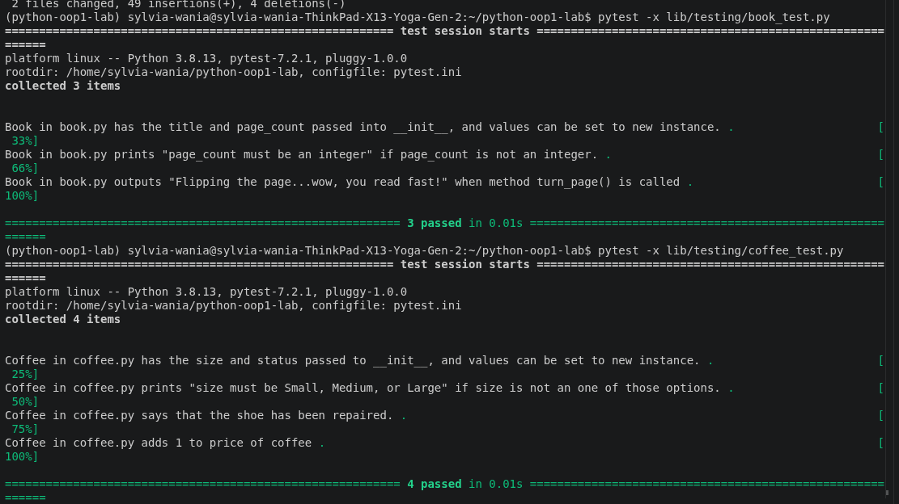

##Bookstore OOP

-A small Python project modeling a bookstore's inventory using two classes: Book and Coffee. Built as part of a lab on object-oriented programming, property validation, and Git workflow (feature branches + pull requests).

-What it does
-Book — has a title and page_count. page_count is validated to always be an integer. Call turn_page() to simulate reading.
-Coffee — has a size (Small, Medium, or Large) and a price. Call tip() to leave a tip, which bumps the price up by 1.
-Getting started
##bash
git clone <your-fork-url>
cd python-oop1-lab
pipenv install
pipenv shell
Usage
python
from lib.book import Book
from lib.coffee import Coffee

book = Book("And Then There Were None", 272)
book.turn_page()

# Flipping the page...wow, you read fast!

coffee = Coffee("Large", 3.50)
coffee.tip()

# This coffee is great, here's a tip!

print(coffee.price)

# 4.5

Running the tests
bash
pytest -x lib/testing/book_test.py
pytest -x lib/testing/coffee_test.py
Screenshot

Show Image

